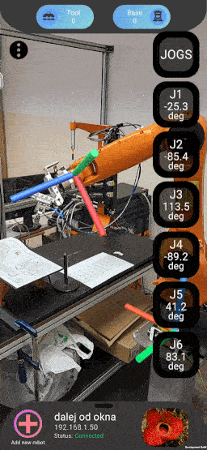
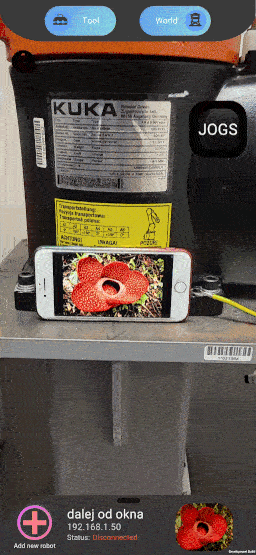
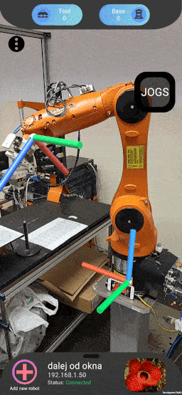
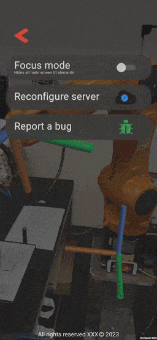
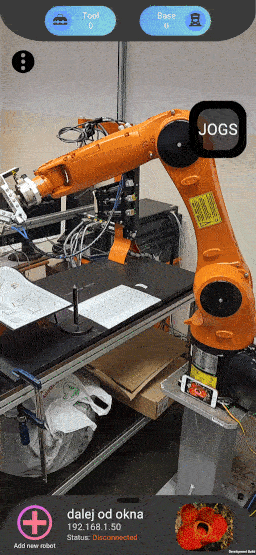

# KUKA AR app 🦾

Project for real-time coordinate system visualization for KUKA robots. Developed as the engineering project that verifies acquired competencies at the end of bachelor's degree.

 
  

## Table of Contents

- [KUKA AR app 🦾](#kuka-ar-app-)
  - [Table of Contents](#table-of-contents)
  - [Overview 🔎](#overview-)
    - [Server-side app 🖥️](#server-side-app-️)
    - [Client-side app 📱](#client-side-app-)
      - [Features](#features)
  - [Preview](#preview)
    - [Image recognition](#image-recognition)
    - [Selecting displayed axis](#selecting-displayed-axis)
    - [Hiding UI elements](#hiding-ui-elements)
    - [Image recognition](#image-recognition-1)
  - [Install 🔄](#install-)
    - [Download 🚚 📦](#download--)
    - [Manual build process 🏗️](#manual-build-process-️)
  - [Configuration 🛠️](#configuration-️)
    - [Android app 📱](#android-app-)
  - [Available configurations 📚](#available-configurations-)
    - [`KukaComm`](#kukacomm)
    - [`TestSocket`](#testsocket)
    - [`Android app`](#android-app)
  - [Usage 🎯](#usage-)
  - [Troubleshooting 🐛 💡](#troubleshooting--)
    - [Connection refused 📶](#connection-refused-)
    - [Unity editor is not showing your device 📴](#unity-editor-is-not-showing-your-device-)
      - [`Developer options disabled`](#developer-options-disabled)
      - [`ADB is not detecting device`](#adb-is-not-detecting-device)
    - [Other problems ⚠️](#other-problems-️)
      - [`Play store check`](#play-store-check)
      - [`App install problem`](#app-install-problem)
      - [`Java jar command missing`](#java-jar-command-missing)
    - [Problem not found on this list?](#problem-not-found-on-this-list)
  - [Contribution :accessibility:](#contribution-accessibility)

## Overview 🔎

Project consists of:
- server-side Java Spring app that manages incoming and outgoing data
- client-side Android Unity app that provides visualization of coordinate system for a user

### Server-side app 🖥️

Its main purpose is to acquire data from target KUKA robot using LAN, process the data and transmit it to the client app. 
<!-- @Przemko that's the place where you can provide more info about the Java side of the project -->

### Client-side app 📱

Requests data from the [server](#server-side-app). Uses received data and capabilities of Android device with [AR Foundation](https://developers.google.com/ar/develop/unity-arf/getting-started-ar-foundation) package to visualize coordinate system of connected robot in real-time.

#### Features

- Image recognition - in order to quickly distinguish between many configured robots, target image system is used as a way to uniquely identify a specific robot.

- AR Anchor Placement system - to keep track of coordinate systems in space, anchor is placed on the detected image, this allows user to move around and maintain a constant position of displayed coordinate systems.

- Communication with server database over HTTP - to store and manage configured robots that user wants to track, CRUD methods with local database are used.

- Instant data acquisition using WebSocket - for more frequent updates and faster reactions to changes in the position of the coordinate system, WebSocket protocol is used.

## Preview

### Image recognition

 
  

### Selecting displayed axis

 
  

### Hiding UI elements

 
  

### Image recognition

 
  

## Install 🔄

### Download 🚚 📦 
Download current version from `Releases` tab OR clone project repository to your local drive.

### Manual build process 🏗️

> Skip this section if you downloaded .jar and .apk files from `Releases` tab

1. Go to project directory:
    - **kukaComm:** `./java/kukaComm`
    - **testSocket:** `./java/testSocket`

    *More information about which one to choose can be found in [_Available configurations_](#avaliable-configurations-📚) section.*

2. Enter command:

        mvn clean install

3. Open project in Unity editor.

4. Plug you phone and turn on developer mode 

    *If you have any questions go to [Troubleshooting](#troubleshooting) section.*

5. In the editor go to:

        File > Build Settings... > Select Android as Platform > Build and Run

6. Wait until the build is finished and enjoy.

## Configuration 🛠️

<!-- @Przemko that's the place where you can describe steps required to set-up connection between Kuka robot and Java server-->

### Android app 📱
1. Connect to the same local network as your server
2. Check for IPv4 address of the machine that your server is deployed on  
   
   You can use `ipconfig` in command line, here's the sample excerpt:

        Wireless LAN adapter WiFi:
        Connection-specific DNS Suffix  . :
        Link-local IPv6 Address . . . . . : <hidden>
        IPv4 Address. . . . . . . . . . . : 192.168.1.25

3. Start the app and provide the address of your server from previous step
4. Check `test connection` button 

   If everything is set-up correctly, app should display green checkmark. Proceed to [Troubleshooting](#troubleshooting-🐛-💡) if you encountered any problems.

## Available configurations 📚 

### `KukaComm` 
Dedicated server side application that serves as a middle-man between KUKA robot and Android application. We recommend using it whenever you have an access to physical robot.

### `TestSocket`
Side project that was created for an easier Android app development. It sends data similar in values and identical in form as `KukaComm`, but those values are mocked on the server side. It is used when implementing new features or debugging an Android app. Eliminates the need for a robot or a robot connection access.

### `Android app`
In order to receive data and work properly, both applications have to be connected to the same network.

## Usage 🎯
After [installation](#install):
1. Open an app
2. Enter valid server IP address
3. Open bottom navigation menu
4. Robot actions:
    1. Observe coords systems:
        1. Open bottom navigation menu
        2. Select robot that you would like to observe
    2. Add new robot:
        1. Click `+` sign in the left bottom corner
        2. Fill the necessary fields
        3. Hit the 'save' button
        4. Go to point **4.1**
6. Enjoy

For more info refer to [instruction](https://github.com/xalpol12/kuka-ar-all/documenatation/XYZ.pdf).

## Troubleshooting 🐛 💡 

### Connection refused 📶 
Check if: 
- Android app is configured with a correct server IP address 

        More options icon > Reconfigure server > *here enter correct IP address*

    *More options icon can be found in left upper corner of your phone.*
- Chosen Spring server (either [KukaCommm](#kukacomm) or [TestSocket](#testsocket) is running 
- Android device is connected to the the same network as a server

### Unity editor is not showing your device 📴 
#### `Developer options disabled`
Check if you have `Developer options` enabled on your device:

        Settings > System > About phone - click on it several times

Usual amout of click is between 7 and 10. Remember that location of `About phone` tab can differ between manufacturers.

#### `ADB is not detecting device`
Go to:

     Settings > Developer Options > Revoke USB debugging authorization

if `Revoke USB debugging authorization` is not available, do not worry.
Turn off and then on USB debugging and confirm all popups.

### Other problems ⚠️ 
#### `Play store check`
If your device shows a window with option to send the app for Google Play store check, please skip it as this app currently is not avaliable in production ready state.

#### `App install problem`
Check if you have "install from unknown sources" enabled in your device settings. If so, then try to install it several time and if popup with warning occurs - ignore it. If this won't help try to install a previous version.

#### `Java jar command missing`
To run `.jar` file, java JDK is required. Recommended version for this project is [Java JDK 17 Termurin](https://www.oracle.com/pl/java/technologies/downloads/#java17).

### Problem not found on this list?
If you encounter any bugs, issues or if you are missing any feature - feel free to submit an [issue](https://github.com/xalpol12/kuka-ar-all/issues). Describe a problem or feature as precisly as you can and mark it with proper label.

## Contribution :accessibility: 
Any contribution is welcome. If there are not any issues currently requested by users feel free to submit new one, and get started working over it.
